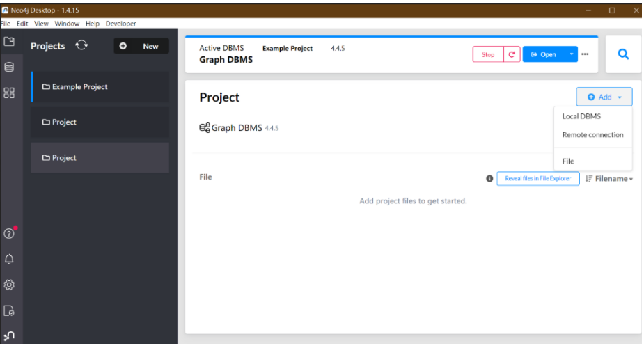
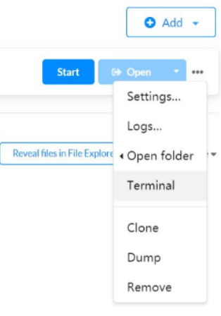

|- figure
|- vis                // Frontend plugin
    |- vis.js
    |- vis.css
|- config.py
|- KG_DEMO.IPYNB      // Demo Notebook
|- utils.py           // Knowledge Graph visualization tool
|- demo_script.py     // Demo function wrapper

## Environment Dependency

### Install neo4j desktop

According to the license of neo4j desktop, the software can only be used for local project development and debugging, **cannot provide external services (i.e., cannot enable external server functionality)**. Neo4j desktop allows free use of all features of the professional version of neo4j, which supports more nodes storage compared to the free community edition of neo4j. In the local environment, neo4j desktop supports all functions of neo4j server.
[Official website neo4j desktop download link](https://neo4j.com/download/?ref=get-started-dropdown-cta)

### Prepare Knowledge Graph Data

Download the *.zip file from the [Harvard Lung Cancer Public Knowledge Graph](https://dataverse.harvard.edu/dataset.xhtml?persistentId=doi:10.7910/DVN/RIXLG8) website. We only need the `./raw/lung-cancer-graph-neo4j-2021-07-15T022024.bin` file from the extracted folder.
Launch the neo4j desktop application. First, stop the default database that starts automatically by clicking the red STOP button at the top. Then create a new project by clicking the **+new** button in the left project section. Select the newly created project, click Add -> local DBMS on the right side to create an empty graph database. **Note: Do not start this newly created database!**

Open the backend terminal of the newly created database: click the three black dots **"..."**, and select Terminal.

Import the Harvard Knowledge Graph: In the terminal, enter the following code to import the neo4j database provided by Harvard (adjust the file path): `.\bin\neo4j-admin load --from=<your_harvard_extracted_folder_path>\raw\lung-cancer-graph-neo4j-2021-07-15T022024.bin`

## Notebook Demo Startup

1. Configure your neo4j account and password in `config.py`.

2. python>=3.6; `pip install py2neo pandas`

3. Start `KG_DEMO.IPYNB`

## Remarks

+ Visualize notebook using vis, which is achieved by displaying HTML pages in the notebook.

+ Generate data using py2neo, other languages, or Python packages can also be used to obtain data, as long as the final data format conforms to the `json` format required by vis.

+ The content of HTML generation is hard-coded to avoid various issues caused by system permissions, such as browser prohibiting loading data from other sources.

+ Compared to VIS.JS, D3.js is recommended more by the official website. The official movie example is done using d3.js.
